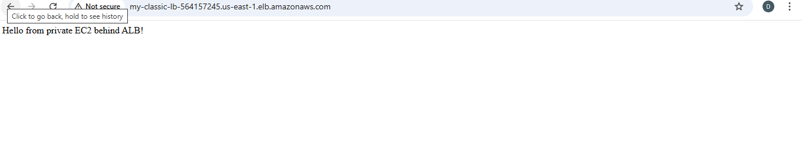
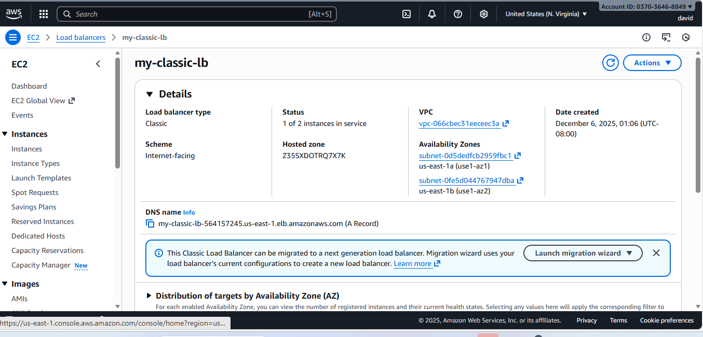
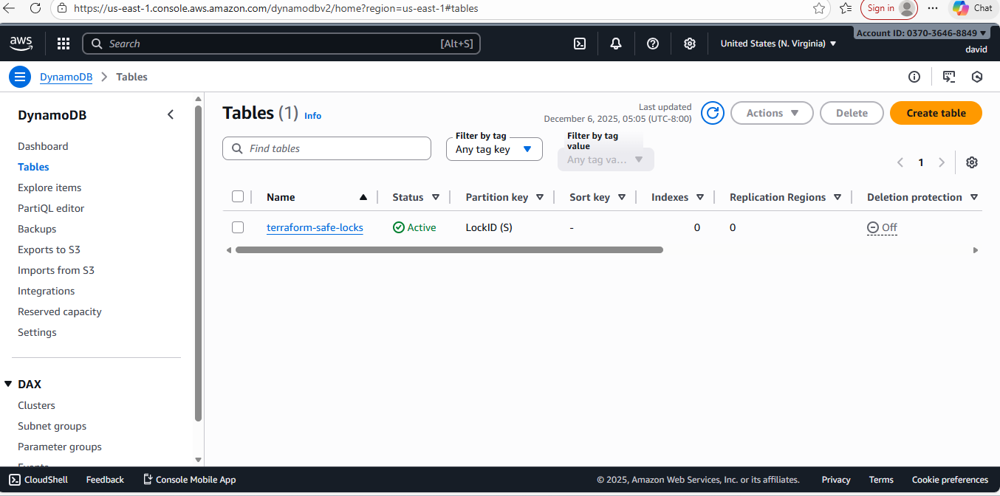
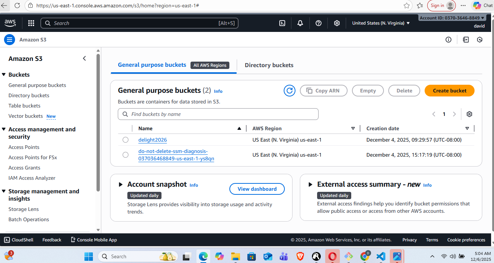
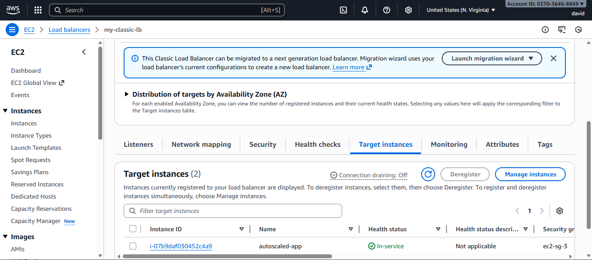
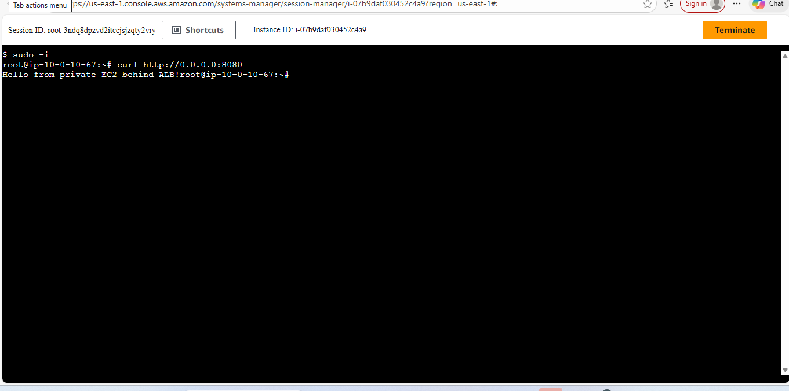
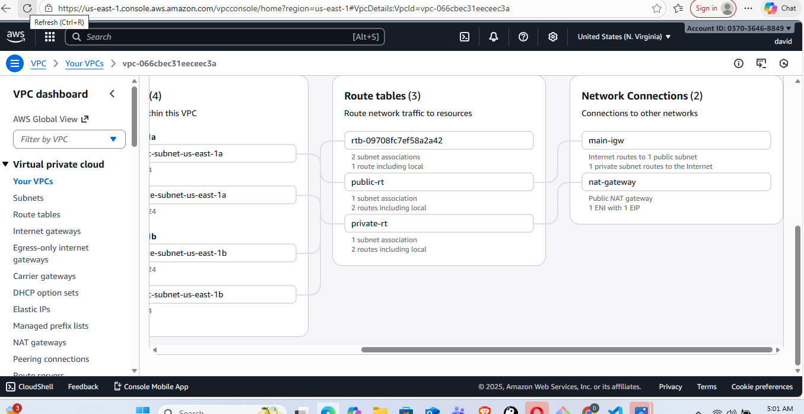

A one-click deployment that provisions a complete AWS architecture running a simple REST API on private EC2 instances behind an Application Load Balancer (ALB) using Terraform.

This solution is fully repeatable, secure, and follows best practices (no public EC2, SSM access, least-privilege IAM).

                      Architecture Overview

Client → CLB (Public Subnets) → Target Group → ASG → EC2 (Private Subnets)
                           ↑
                 Security Groups
                           ↓
Private EC2 → NAT Gateway → Internet Gateway

AWS Resources Created

VPC (CIDR: 10.0.0.0/16)

2 Public Subnets + 2 Private Subnets
Internet Gateway

NAT Gateway
Route Tables

classic Load Balancer (HTTP/HTTPS) (i used classic load balancer because my aws acccount could not create application load balancer due to the fact that my account is less than 72hours old)

Launch Template (EC2 with user-data)
Auto Scaling Group (Private Subnets)

IAM Role for EC2:
AmazonSSMManagedInstanceCore
CloudWatchAgentServerPolicy
S3 bucket access

Security Groups:

CLB SG → allow 80/443 from anywhere
EC2 SG → allow only from ELB SG

dynamo DB for statelocking of terraform statefiles (security best practice)
s3 bucket for storing terraform statefiles and also the zipped app folder

                  DEPLOYMENT STEPS
         Cd into scripts and run ./deploy.sh

                  TEARDOWN STEP
        Cd into scripts and run ./destroy.sh

                  TESTING STEPS
check pm2 status (check server status on EC2)
curl http://0.0.0.0:8080 (test locally on EC2)
http://my-classic-lb-564157245.us-east-1.elb.amazonaws.com/ (test API from a broswer)

              
                Github actions workflow (optional)
name: Deploy to AWS

on:
  push:
    branches:
      - main

jobs:
  deploy:
    runs-on: ubuntu-latest
    steps:
      - uses: actions/checkout@v3
      - name: Setup Terraform
        uses: hashicorp/setup-terraform@v2
      - name: Terraform Init & Apply
        run: |
          cd terraform
          cd VPC
          terraform init
          terraform apply -auto-approve
      

                   SCREENSHOTS
API Test on Browser                   

Application Load Balancer – Creation Error

Classic Load Balancer

DynamoDB Console

EC2 Console

S3 Console

Target Group & Registered Instance

Target Instance

Test on EC2

VPC Console Extension

VPC Console

