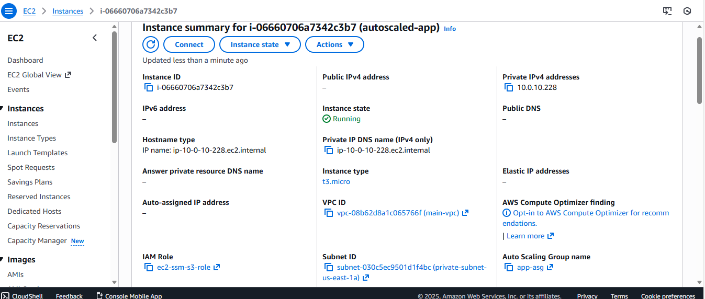

One-Click AWS Deployment for a REST API
This project provides a one-click deployment solution that provisions a complete AWS architecture to run a simple REST API. The API runs on private EC2 instances behind a Classic Load Balancer (CLB), with Terraform managing the infrastructure.
The deployment is fully repeatable, secure, and follows AWS best practices, including:
No public EC2 instances

Secure SSM access

Least-privilege IAM policies

Architecture Overview
Client → CLB (Public Subnets) → Target Group → ASG → EC2 (Private Subnets)
                           ↑
                 Security Groups
                           ↓
Private EC2 → NAT Gateway → Internet Gateway

Key Points:
EC2 instances are deployed in private subnets for security.
Traffic is routed through the Classic Load Balancer (CLB).
NAT Gateway and Internet Gateway enable outbound access for private instances.
Security groups enforce strict access: only the CLB can access EC2 instances.

AWS Resources Created
VPC: CIDR 10.0.0.0/16
Subnets: 2 public and 2 private
Internet Gateway
NAT Gateway
Route Tables
Classic Load Balancer (HTTP/HTTPS)
Note: A Classic Load Balancer is used because this AWS account is less than 72 hours old and cannot create an Application Load Balancer.
Launch Template: EC2 instances with user-data scripts
Auto Scaling Group: EC2 instances in private subnets
IAM Role for EC2:
AmazonSSMManagedInstanceCore
CloudWatchAgentServerPolicy
S3 bucket access
Security Groups:
CLB SG → allows HTTP/HTTPS from anywhere
EC2 SG → allows traffic only from the CLB SG
DynamoDB table for Terraform state locking (security best practice)
S3 bucket for storing Terraform state files and zipped application files

Deployment Steps
Navigate to the scripts directory:
cd scripts
Run the deployment script:
./deploy.sh

Teardown Step
To destroy all deployed resources:
cd scripts
./destroy.sh

Testing Steps
Check server status on EC2:

pm2 status
Test API locally on EC2:

curl http://0.0.0.0:8080
Test API via Load Balancer:
Visit the Classic Load Balancer URL in a browser:

http://my-classic-lb-564157245.us-east-1.elb.amazonaws.com/

GitHub Actions Workflow (Optional)
Automate deployment on every push to master:
name: Deploy to AWS

on:
  push:
    branches:
      - master

jobs:
  deploy:
    runs-on: ubuntu-latest
    steps:
      - uses: actions/checkout@v3
      - name: Setup Terraform
        uses: hashicorp/setup-terraform@v2
      - name: Terraform Init & Apply
        run: |
          cd terraform/VPC
          terraform init
          terraform apply -auto-approve

      

| Feature                                    | Screenshot                                                                                                    |
| ------------------------------------------ | ------------------------------------------------------------------------------------------------------------- |
| API Test on Browser                        |                                        |
| Application Load Balancer – Creation Error |  |
| Classic Load Balancer                      |                                            |
| DynamoDB Console                           |                                                        |
| EC2 Console                                |                                                                    |
| S3 Console                                 |                                                                    |
| Target Group & Registered Instance         |            |
| Target Instance                            |                                                          |
| Test on EC2                                |                                                                |
| VPC Console Extension                      |                                            |
| VPC Console                                |                                                                  |

